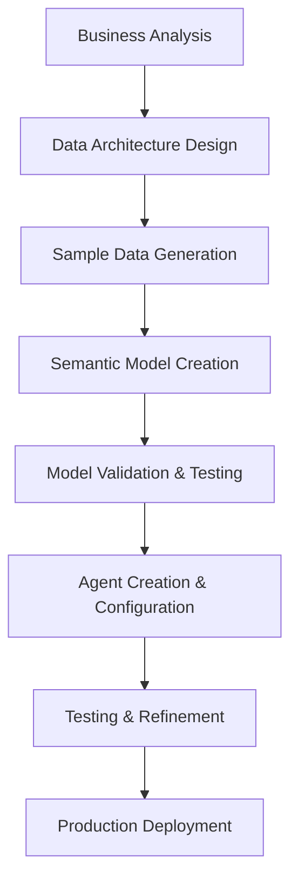

# Snowflake Agent Creation Guide: From Data to Intelligence

## Overview

This guide outlines the complete process for creating Snowflake Cortex Analyst agents from scratch, based on real-world experience building semantic models for enterprise customers. The process transforms business requirements into intelligent, natural language query interfaces using Snowflake's AI capabilities.

## Process Overview



## Step 1: Business Analysis & Requirements Gathering

### 1.1 Customer Research
- **Review customer website** for products, services, and business model
- **Identify key business domains** (e.g., sales, operations, customer service)
- **Understand industry-specific terminology** and metrics
- **Map business processes** and data flow

### 1.2 Define Analytics Scope
- **Primary use cases**: What questions will users ask?
- **Key stakeholders**: Who will use these agents?
- **Success metrics**: How will you measure effectiveness?
- **Data requirements**: What data is needed for meaningful insights?

**Example Business Domain Analysis:**
```
Business Domains Identified:
- Customer Analytics (behavior, demographics, lifetime value)
- Operations Analytics (performance, efficiency, capacity)
- Revenue Analytics (sales, pricing, profitability)
- Employee Management (performance, scheduling, training)
- Product/Service Analytics (usage, satisfaction, optimization)
```

## Step 2: Data Architecture Design

### 2.1 Database Structure Planning
Design your database schema with clear separation of concerns:

```sql
-- Example structure
DATABASE_NAME
├── DOMAIN_1_SCHEMA
│   ├── FACT_TABLE_1
│   ├── FACT_TABLE_2
│   └── DIMENSION_TABLE_1
├── DOMAIN_2_SCHEMA
│   ├── FACT_TABLE_3
│   └── DIMENSION_TABLE_2
└── SHARED_SCHEMA
    ├── LOOKUP_TABLES
    └── REFERENCE_DATA
```

### 2.2 Key Design Principles
- **One schema per business domain** for logical separation
- **Clear table naming conventions** (avoid abbreviations)
- **Consistent data types** across related tables
- **Proper primary keys** for all tables
- **Foreign key relationships** for data integrity

## Step 3: Sample Data Generation with Cursor

### 3.1 Initial Data Request
Use this proven prompt pattern with Cursor:

```
Create a comprehensive SQL script for [CUSTOMER_NAME] that includes:
1. Database and schema creation for [BUSINESS_DOMAINS]
2. Table definitions with appropriate data types
3. Synthetic data generation with realistic business values
4. Data validation queries

Make the data specific to [CUSTOMER_INDUSTRY] and include:
- [SPECIFIC_PRODUCTS/SERVICES]
- [KEY_BUSINESS_METRICS]
- [INDUSTRY_TERMINOLOGY]

Generate at least [NUMBER] records per table with realistic relationships.
```

### 3.2 Data Type Considerations
**Critical Lessons Learned:**
- **DECIMAL precision**: Use `DECIMAL(4,2)` instead of `DECIMAL(3,2)` for ratings (avoids 10.0 overflow)
- **Date/Time types**: Use `TIMESTAMP_NTZ` for events, `DATE` for simple dates
- **Text fields**: Use `VARCHAR(255)` or `TEXT` based on expected content length
- **Boolean fields**: Use `BOOLEAN` type consistently

### 3.3 Synthetic Data Quality
Ensure generated data includes:
- **Realistic value distributions** (not just random numbers)
- **Seasonal patterns** for time-based data
- **Logical relationships** between tables
- **Edge cases** for testing (nulls, extremes)

**Example Realistic Data Generation:**
```sql
-- Good: Realistic rating distribution
UNIFORM(70, 99, RANDOM()) / 10.0  -- Generates 7.0-9.9 ratings

-- Bad: Unrealistic uniform distribution
UNIFORM(1, 10, RANDOM())  -- Generates 1-10 uniformly

-- Good: Seasonal sales patterns
CASE 
    WHEN EXTRACT(MONTH FROM date_column) IN (11,12) THEN base_amount * 1.4
    WHEN EXTRACT(MONTH FROM date_column) IN (6,7,8) THEN base_amount * 1.2
    ELSE base_amount
END
```

## Step 4: Semantic Model Creation

### 4.1 Obtain Reference Template
Start with a working semantic model YAML file that demonstrates:
- Proper YAML structure and indentation
- Table definitions with base_table references
- Dimension and fact definitions
- Relationship specifications
- Verified queries examples

### 4.2 Model Creation Process
Use this prompt pattern with Cursor:

```
Create a semantic model YAML file for [BUSINESS_DOMAIN] using this template structure.

Requirements:
1. Define tables for: [TABLE_LIST]
2. Include dimensions, time_dimensions, and facts for each table
3. Create relationships between tables using proper foreign keys
4. Add 5 verified_queries with realistic business questions
5. Include custom_instructions with business context

Base your field definitions on the database schema from [DATA_SCRIPT].
```

### 4.3 Critical YAML Structure Elements

**Table Definition Template:**
```yaml
- name: table_name
  base_table:
    database: DATABASE_NAME
    schema: SCHEMA_NAME
    table: TABLE_NAME
  dimensions:
    - name: dimension_name
      data_type: TEXT|NUMBER|BOOLEAN
      expr: COLUMN_NAME
      description: Clear business description
      unique: true  # if applicable
  time_dimensions:
    - name: time_dimension_name
      data_type: DATE|TIMESTAMP
      expr: COLUMN_NAME
      description: When this occurs
  facts:
    - name: fact_name
      data_type: NUMBER
      expr: SUM(COLUMN_NAME)  # Use aggregation functions
      description: What this measures
  primary_key:
    columns:
      - PRIMARY_KEY_COLUMN
```

**Relationship Definition:**
```yaml
relationships:
  - name: descriptive_relationship_name
    left_table: table1_name
    right_table: table2_name
    expr: table1.column = table2.column
```

### 4.4 Common Pitfalls to Avoid

**❌ Invalid Column References in Facts:**
```yaml
# Wrong: Referencing calculated facts as direct columns
facts:
  - name: net_revenue
    expr: SUM(NET_REVENUE)  # NET_REVENUE doesn't exist in base table
```

**✅ Correct Fact Calculations:**
```yaml
# Correct: Calculate from actual base table columns
facts:
  - name: net_revenue
    expr: SUM(TICKET_PRICE - DISCOUNT_AMOUNT)
```

**❌ Undefined Table Relationships:**
```yaml
# Wrong: Referencing tables not defined in this model
relationships:
  - name: guest_hotel_stays
    left_table: guest_profiles  # Not defined in this YAML
    right_table: room_reservations
```

**✅ Valid Relationships:**
```yaml
# Correct: Only reference tables defined in current model
relationships:
  - name: property_reservations
    left_table: hotel_properties
    right_table: room_reservations
    expr: hotel_properties.property_id = room_reservations.property_id
```

## Step 5: Model Validation & Testing

### 5.1 SQL Script Testing
Create a comprehensive test script:

```sql
-- Test verified queries from semantic models
-- Example structure:
SELECT 'Testing: Customer Analytics Model' as test_section;

-- Query 1: Customer Demographics Analysis
SELECT 
    c.CUSTOMER_TIER,
    COUNT(DISTINCT c.CUSTOMER_ID) as customer_count,
    AVG(c.TOTAL_SPEND_AMOUNT) as avg_lifetime_value
FROM ENTERPRISE_DATA_PLATFORM.CUSTOMER_ANALYTICS.CUSTOMER_PROFILES c
GROUP BY c.CUSTOMER_TIER
ORDER BY avg_lifetime_value DESC
LIMIT 10;

-- Query 2: Revenue Performance Analysis
SELECT 
    DATE_TRUNC('month', s.SALE_DATE) as month,
    SUM(s.SALE_AMOUNT) as total_revenue,
    COUNT(DISTINCT s.CUSTOMER_ID) as unique_customers
FROM ENTERPRISE_DATA_PLATFORM.REVENUE_ANALYTICS.SALES s
GROUP BY DATE_TRUNC('month', s.SALE_DATE)
ORDER BY month DESC;
```

### 5.2 Common Validation Errors & Fixes

**Error Type 1: Data Type Range Issues**
```
Error: Number out of representable range: type FIXED[SB2](3,2), value 10.000000
Fix: Change DECIMAL(3,2) to DECIMAL(4,2) in table definition
```

**Error Type 2: Invalid Column References**
```
Error: invalid identifier 'C.CUSTOMER_SEGMENT'
Fix: Add proper JOIN to table containing CUSTOMER_SEGMENT column
```

**Error Type 3: YAML Compilation Errors**
```
Error: invalid identifier 'S.NET_REVENUE'
Fix: Use base table columns in calculations: SUM(s.SALE_AMOUNT - s.DISCOUNT_AMOUNT)
```

### 5.3 Validation Checklist
- [ ] All table names match database schema exactly
- [ ] All column references use actual base table columns
- [ ] All relationships reference tables defined in the current model
- [ ] Facts use proper aggregation functions
- [ ] Verified queries run successfully in Snowflake
- [ ] Data types match between YAML and database schema

## Step 6: Snowflake Deployment

### 6.1 Stage Upload Process
```sql
-- Create stage for semantic models (one-time setup)
CREATE STAGE IF NOT EXISTS semantic_models_stage;

-- Upload YAML files to stage
PUT file:///path/to/customer_analytics.yaml @semantic_models_stage;
PUT file:///path/to/revenue_analytics.yaml @semantic_models_stage;
PUT file:///path/to/operations_analytics.yaml @semantic_models_stage;
-- ... repeat for all models
```

### 6.2 Cortex Analyst Validation
1. **Navigate to Cortex Analyst** in Snowflake UI
2. **Import semantic model** from stage
3. **Validate syntax** - fix any errors
4. **Test sample queries** to verify functionality
5. **Iterate and refine** based on results

### 6.3 Role and Privilege Setup (One-time)
```sql
-- Grant necessary privileges for Cortex Analyst
GRANT USAGE ON DATABASE ENTERPRISE_DATA_PLATFORM TO ROLE analyst_role;
GRANT USAGE ON ALL SCHEMAS IN DATABASE ENTERPRISE_DATA_PLATFORM TO ROLE analyst_role;
GRANT SELECT ON ALL TABLES IN DATABASE ENTERPRISE_DATA_PLATFORM TO ROLE analyst_role;
GRANT USAGE ON WAREHOUSE compute_wh TO ROLE analyst_role;
```

## Step 7: Agent Creation & Configuration

### 7.1 Agent Creation Process
For each semantic model:

1. **Create new agent** in Snowflake Intelligence UI
2. **Upload semantic model** YAML file
3. **Configure agent settings**:
   - Agent name and description
   - Sample questions
   - Business context
4. **Test agent responses** with various queries

### 7.2 Agent Configuration Best Practices

**Agent Name Convention:**
```
[Company] [Domain] Analytics Agent
Example: "Acme Customer Analytics Agent"
```

**Sample Questions (Generate 8-10 per agent):**
```
Business Executive Level:
- "What are our top-performing products by customer satisfaction?"
- "How does revenue vary across regions this quarter?"
- "Which customer segments have the highest lifetime value?"

Operational Level:
- "What are our current inventory levels by product category?"
- "Which operations have efficiency ratings below target?"
- "What are the staffing levels by department for next week?"

Analytical Level:
- "Show me customer lifetime value analysis by segment"
- "Compare sales performance across product lines"
- "Analyze seasonal trends in customer behavior"
```

**Agent Description Template:**
```
This agent provides [DOMAIN] analytics for [COMPANY], enabling natural language queries about [KEY_CAPABILITIES]. 

Key insights include:
• [INSIGHT_1]
• [INSIGHT_2]  
• [INSIGHT_3]

Ask questions about [EXAMPLE_TOPICS] to get started.
```

## Step 8: Testing Agents in Snowflake Intelligence

### 8.1 Accessing Snowflake Intelligence UI

**Navigation Steps:**
1. **Log into Snowflake Web UI** with appropriate role
2. **Navigate to "Projects"** in the left sidebar
3. **Click "Snowflake Intelligence"** (may also be called "AI & ML")
4. **Select "Agents"** from the Intelligence dashboard
5. **Choose your agent** from the list of created agents

### 8.2 Agent Testing Interface

**Key Components:**
- **Query Input Box**: Where you type natural language questions
- **Response Panel**: Shows agent's answer with data and charts
- **Query History**: Previous questions and responses
- **Settings Panel**: Agent configuration and model selection

### 8.3 Testing Methodology

**Phase 1: Basic Functionality Testing**
```
Test Categories:
1. Simple aggregations: "What is our total revenue this month?"
2. Filtering: "Show me customers from California"
3. Comparisons: "Compare sales between Q1 and Q2"
4. Time-based: "What were our sales last week vs this week?"
5. Grouping: "Break down revenue by product category"
```

**Phase 2: Complex Query Testing**
```
Advanced Tests:
1. Multi-table joins: "Which customers bought our premium products?"
2. Nested conditions: "Show top 10 customers who made purchases over $1000 in the last 6 months"
3. Calculations: "What is the average order value by customer segment?"
4. Trending: "Show monthly growth rate for our key metrics"
5. Ranking: "Rank our products by profitability"
```

**Phase 3: Edge Case Testing**
```
Edge Cases:
1. Invalid dates: "Show sales for February 30th"
2. Non-existent data: "Revenue for products we don't sell"
3. Ambiguous queries: "Show me the best customers" (what defines "best"?)
4. Very large date ranges: "All sales data since 1900"
5. Complex business logic: Industry-specific terminology and calculations
```

### 8.4 Response Quality Evaluation

**Check for Accuracy:**
- [ ] **Data correctness**: Results match expected values
- [ ] **Query interpretation**: Agent understood the question correctly
- [ ] **Calculation accuracy**: Mathematical operations are correct
- [ ] **Filter application**: Conditions applied properly

**Evaluate Completeness:**
- [ ] **All relevant data included**: No important information missing
- [ ] **Proper context**: Results include necessary background info
- [ ] **Appropriate granularity**: Right level of detail for the question
- [ ] **Comparative data**: Includes benchmarks when relevant

**Assess Presentation:**
- [ ] **Clear visualizations**: Charts and graphs are appropriate
- [ ] **Readable formatting**: Tables and text are well-organized
- [ ] **Actionable insights**: Results lead to business decisions
- [ ] **Explanation quality**: Agent explains methodology when helpful

### 8.5 Performance Testing

**Response Time Benchmarks:**
```
Acceptable Response Times:
- Simple queries: < 10 seconds
- Complex queries: < 30 seconds
- Very complex queries: < 60 seconds
- Data refresh queries: < 2 minutes
```

**Load Testing:**
1. **Test concurrent users** (5-10 simultaneous queries)
2. **Test during peak hours** when data warehouse is busy
3. **Test with different query complexity** levels
4. **Monitor warehouse utilization** during testing

### 8.6 Common Testing Issues & Solutions

**Issue: Slow Response Times**
```
Troubleshooting Steps:
1. Check warehouse size and auto-suspend settings
2. Review semantic model for expensive calculations
3. Optimize fact definitions to use proper aggregations
4. Consider pre-aggregated summary tables
5. Check for Cartesian products in relationships
```

**Issue: Incorrect Results**
```
Debugging Process:
1. Verify data in underlying tables manually
2. Check semantic model column expressions
3. Validate relationship definitions
4. Review fact calculations for logic errors
5. Test individual components of complex queries
```

**Issue: Agent Doesn't Understand Questions**
```
Improvement Actions:
1. Add more diverse sample questions to agent
2. Improve dimension and fact descriptions
3. Add synonyms for business terminology
4. Enhance custom_instructions with context
5. Train users on effective question phrasing
```

### 8.7 User Acceptance Testing

**Business User Testing Protocol:**
1. **Recruit representative users** from each stakeholder group
2. **Provide minimal training** on how to phrase questions
3. **Give realistic scenarios** relevant to their roles
4. **Observe query patterns** and success rates
5. **Collect feedback** on usefulness and accuracy

**Test Scenarios by Role:**
```
Executive Users:
- High-level KPI questions
- Trend analysis requests
- Comparative performance queries
- Strategic planning questions

Operational Users:
- Detailed operational metrics
- Real-time status queries
- Exception identification
- Performance monitoring

Analytical Users:
- Complex statistical analysis
- Deep-dive investigations
- Custom calculation requests
- Data exploration queries
```

### 8.8 Documentation & Feedback Loop

**Testing Documentation:**
- **Query logs**: All test questions and responses
- **Performance metrics**: Response times and resource usage
- **Error reports**: Failed queries and resolution steps
- **User feedback**: Satisfaction scores and improvement suggestions

**Continuous Improvement:**
1. **Weekly review** of query logs and user feedback
2. **Monthly model updates** based on usage patterns
3. **Quarterly agent enhancement** with new capabilities
4. **Annual comprehensive review** of entire semantic model

## Step 9: Production Deployment & Maintenance

### 9.1 Deployment Checklist
- [ ] All models validated and tested
- [ ] Agents configured with comprehensive sample questions
- [ ] User roles and permissions configured
- [ ] Documentation updated
- [ ] Training materials prepared

### 9.2 Ongoing Maintenance
- **Monitor agent usage** and popular queries
- **Update sample questions** based on user patterns
- **Refresh data** on regular schedule
- **Add new models** as business needs evolve

## Common Issues & Solutions

**Issue: Slow Query Performance**
```
Solution: 
- Add indexes on frequently queried columns
- Optimize fact calculations
- Consider pre-aggregated tables for complex metrics
```

**Issue: Confusing Agent Responses**
```
Solution:
- Improve column descriptions in YAML
- Add more context in custom_instructions
- Refine sample questions for clarity
```

## Best Practices & Lessons Learned

### Data Design
1. **Use realistic value ranges** in synthetic data generation
2. **Maintain consistent naming conventions** across all tables
3. **Design for scalability** - consider future data growth
4. **Include proper data lineage** documentation

### Model Development
1. **Start simple** - basic models before complex relationships
2. **Test incrementally** - validate each component
3. **Use descriptive names** for all dimensions and facts
4. **Include business context** in custom instructions

### Agent Configuration
1. **Provide diverse sample questions** covering different user types
2. **Use business terminology** in descriptions
3. **Test with actual business users** before deployment
4. **Monitor and iterate** based on usage patterns

### Common Pitfalls
1. **Over-complex initial models** - start simple and expand
2. **Inconsistent data types** - standardize across tables
3. **Missing relationships** - ensure all logical connections exist
4. **Poor sample questions** - make them realistic and valuable

## Replication Strategy

Once you have a working model:

1. **Save template structures** for common table types
2. **Standardize naming conventions** across all projects
3. **Create reusable components** for common business metrics
4. **Document lessons learned** for each industry vertical
5. **Build library of sample questions** by business function

## Tools & Resources

### Required Tools
- **Cursor AI** for data and model generation
- **Snowflake UI** for validation and testing
- **SQL client** for data verification
- **YAML editor** for model refinement

### Helpful Resources
- Snowflake Cortex Analyst documentation
- YAML syntax validators
- Industry-specific business intelligence frameworks
- Customer website analysis for business context

---

## Appendix A: Sample Semantic Model YAML

Here's a complete example semantic model YAML file that demonstrates proper structure and syntax:

```yaml
name: customer_analytics
description: Customer behavior and demographics analytics for data-driven customer insights and segmentation
tables:
  - name: customer_profiles
    base_table:
      database: ENTERPRISE_DATA_PLATFORM
      schema: CUSTOMER_ANALYTICS
      table: CUSTOMER_PROFILES
    dimensions:
      - name: customer_id
        data_type: TEXT
        expr: CUSTOMER_ID
        description: Unique customer identifier
        unique: true
      - name: customer_tier
        data_type: TEXT
        expr: CUSTOMER_TIER
        description: Customer membership tier (Bronze, Silver, Gold, Platinum)
      - name: geographic_region
        data_type: TEXT
        expr: GEOGRAPHIC_REGION
        description: Customer's geographic region
      - name: acquisition_channel
        data_type: TEXT
        expr: ACQUISITION_CHANNEL
        description: How customer was acquired (Online, Retail, Referral, Partner)
      - name: customer_segment
        data_type: TEXT
        expr: CUSTOMER_SEGMENT
        description: Business-defined customer segment
    time_dimensions:
      - name: registration_date
        data_type: DATE
        expr: REGISTRATION_DATE
        description: Date customer registered
      - name: last_activity_date
        data_type: DATE
        expr: LAST_ACTIVITY_DATE
        description: Date of most recent customer activity
    facts:
      - name: total_spend_amount
        data_type: NUMBER
        expr: SUM(TOTAL_SPEND_AMOUNT)
        description: Total amount customer has spent
      - name: average_order_value
        data_type: NUMBER
        expr: AVG(TOTAL_SPEND_AMOUNT / TOTAL_ORDERS)
        description: Average value per customer order
      - name: customer_lifetime_value
        data_type: NUMBER
        expr: SUM(TOTAL_SPEND_AMOUNT + MEMBERSHIP_VALUE)
        description: Calculated customer lifetime value
      - name: total_orders
        data_type: NUMBER
        expr: SUM(TOTAL_ORDERS)
        description: Total number of orders placed
      - name: customer_count
        data_type: NUMBER
        expr: COUNT(DISTINCT CUSTOMER_ID)
        description: Number of unique customers
    description: ''
    synonyms: []
    primary_key:
      columns:
        - CUSTOMER_ID
  - name: purchase_transactions
    base_table:
      database: ENTERPRISE_DATA_PLATFORM
      schema: CUSTOMER_ANALYTICS
      table: PURCHASE_TRANSACTIONS
    dimensions:
      - name: transaction_id
        data_type: TEXT
        expr: TRANSACTION_ID
        description: Unique transaction identifier
        unique: true
      - name: customer_id
        data_type: TEXT
        expr: CUSTOMER_ID
        description: Customer who made the purchase
      - name: product_category
        data_type: TEXT
        expr: PRODUCT_CATEGORY
        description: Category of purchased product
      - name: purchase_channel
        data_type: TEXT
        expr: PURCHASE_CHANNEL
        description: Channel where purchase was made (Online, In-Store, Mobile)
      - name: payment_method
        data_type: TEXT
        expr: PAYMENT_METHOD
        description: Method of payment used
    time_dimensions:
      - name: transaction_date
        data_type: DATE
        expr: TRANSACTION_DATE
        description: Date of the transaction
      - name: transaction_timestamp
        data_type: TIMESTAMP
        expr: TRANSACTION_TIMESTAMP
        description: Exact timestamp of transaction
    facts:
      - name: transaction_amount
        data_type: NUMBER
        expr: SUM(TRANSACTION_AMOUNT)
        description: Total transaction amount
      - name: discount_amount
        data_type: NUMBER
        expr: SUM(DISCOUNT_AMOUNT)
        description: Total discount applied
      - name: net_amount
        data_type: NUMBER
        expr: SUM(TRANSACTION_AMOUNT - DISCOUNT_AMOUNT)
        description: Net amount after discounts
      - name: transaction_count
        data_type: NUMBER
        expr: COUNT(TRANSACTION_ID)
        description: Number of transactions
      - name: average_transaction_value
        data_type: NUMBER
        expr: AVG(TRANSACTION_AMOUNT)
        description: Average transaction amount
    description: ''
    synonyms: []
    primary_key:
      columns:
        - TRANSACTION_ID
relationships:
  - name: customer_purchases
    left_table: customer_profiles
    right_table: purchase_transactions
    expr: customer_profiles.customer_id = purchase_transactions.customer_id
verified_queries:
  - name: customer_segment_analysis
    question: What are the key characteristics and spending patterns of our customer segments?
    sql: SELECT c.CUSTOMER_SEGMENT, COUNT(DISTINCT c.CUSTOMER_ID) as customer_count, AVG(c.TOTAL_SPEND_AMOUNT + c.MEMBERSHIP_VALUE) as avg_lifetime_value, AVG(c.TOTAL_SPEND_AMOUNT / c.TOTAL_ORDERS) as avg_order_value FROM ENTERPRISE_DATA_PLATFORM.CUSTOMER_ANALYTICS.CUSTOMER_PROFILES c GROUP BY c.CUSTOMER_SEGMENT ORDER BY avg_lifetime_value DESC
  - name: channel_performance_analysis
    question: How do different acquisition and purchase channels perform in terms of customer value?
    sql: SELECT c.ACQUISITION_CHANNEL, t.PURCHASE_CHANNEL, COUNT(DISTINCT c.CUSTOMER_ID) as customers, SUM(t.TRANSACTION_AMOUNT - t.DISCOUNT_AMOUNT) as net_revenue, AVG(t.TRANSACTION_AMOUNT) as avg_transaction_value FROM ENTERPRISE_DATA_PLATFORM.CUSTOMER_ANALYTICS.CUSTOMER_PROFILES c JOIN ENTERPRISE_DATA_PLATFORM.CUSTOMER_ANALYTICS.PURCHASE_TRANSACTIONS t ON c.CUSTOMER_ID = t.CUSTOMER_ID GROUP BY c.ACQUISITION_CHANNEL, t.PURCHASE_CHANNEL ORDER BY net_revenue DESC
  - name: monthly_revenue_trends
    question: What are our monthly revenue trends and how do they vary by customer segment?
    sql: SELECT DATE_TRUNC('month', t.TRANSACTION_DATE) as month, c.CUSTOMER_SEGMENT, SUM(t.TRANSACTION_AMOUNT - t.DISCOUNT_AMOUNT) as net_revenue, COUNT(DISTINCT t.CUSTOMER_ID) as active_customers FROM ENTERPRISE_DATA_PLATFORM.CUSTOMER_ANALYTICS.PURCHASE_TRANSACTIONS t JOIN ENTERPRISE_DATA_PLATFORM.CUSTOMER_ANALYTICS.CUSTOMER_PROFILES c ON t.CUSTOMER_ID = c.CUSTOMER_ID GROUP BY DATE_TRUNC('month', t.TRANSACTION_DATE), c.CUSTOMER_SEGMENT ORDER BY month DESC, net_revenue DESC
  - name: high_value_customer_identification
    question: Who are our highest value customers and what are their purchasing behaviors?
    sql: SELECT c.CUSTOMER_ID, c.CUSTOMER_TIER, c.GEOGRAPHIC_REGION, c.TOTAL_SPEND_AMOUNT + c.MEMBERSHIP_VALUE as lifetime_value, COUNT(DISTINCT t.TRANSACTION_ID) as total_transactions, AVG(t.TRANSACTION_AMOUNT) as avg_transaction_value FROM ENTERPRISE_DATA_PLATFORM.CUSTOMER_ANALYTICS.CUSTOMER_PROFILES c LEFT JOIN ENTERPRISE_DATA_PLATFORM.CUSTOMER_ANALYTICS.PURCHASE_TRANSACTIONS t ON c.CUSTOMER_ID = t.CUSTOMER_ID GROUP BY c.CUSTOMER_ID, c.CUSTOMER_TIER, c.GEOGRAPHIC_REGION, c.TOTAL_SPEND_AMOUNT, c.MEMBERSHIP_VALUE HAVING lifetime_value > 1000 ORDER BY lifetime_value DESC LIMIT 50
  - name: seasonal_buying_patterns
    question: How do customer buying patterns change throughout the year?
    sql: SELECT EXTRACT(MONTH FROM t.TRANSACTION_DATE) as month, EXTRACT(QUARTER FROM t.TRANSACTION_DATE) as quarter, COUNT(DISTINCT t.TRANSACTION_ID) as transaction_count, SUM(t.TRANSACTION_AMOUNT - t.DISCOUNT_AMOUNT) as net_revenue, COUNT(DISTINCT t.CUSTOMER_ID) as unique_customers, AVG(t.TRANSACTION_AMOUNT) as avg_transaction_value FROM ENTERPRISE_DATA_PLATFORM.CUSTOMER_ANALYTICS.PURCHASE_TRANSACTIONS t GROUP BY EXTRACT(MONTH FROM t.TRANSACTION_DATE), EXTRACT(QUARTER FROM t.TRANSACTION_DATE) ORDER BY month
custom_instructions: |
  Business context:
  - This company operates in retail/e-commerce with focus on customer experience
  - Key performance indicators include customer lifetime value, retention rates, and average order value
  - Customer segmentation drives personalized marketing and product recommendations
  - Seasonal patterns are important for inventory planning and marketing campaigns
  - Multi-channel strategy includes online, mobile, and physical retail locations
  - Customer acquisition cost optimization is a key business objective
  - Data-driven insights inform pricing strategies and promotional campaigns
```

## Appendix B: Sample README Template

Here's a comprehensive README template for documenting your semantic models:

```markdown
# [Company Name] - Snowflake Intelligence Semantic Models

## Overview

This collection of semantic model YAML files enables **Snowflake Cortex Analyst** to provide natural language analytics for [Company Name], supporting comprehensive business intelligence across all aspects of [business domain] operations.

## Created Models

### 1. **Customer Analytics** (`customer_analytics.yaml`)
**Focus**: Customer behavior, demographics, and lifetime value analysis

**Key Tables**:
- `customer_profiles` - Customer demographics, tiers, and value metrics
- `purchase_transactions` - Purchase history and transaction details
- `customer_interactions` - Support tickets, feedback, and engagement

**Sample Questions**:
- "Who are our highest value customers by segment?"
- "What are the seasonal purchasing patterns?"
- "How does customer acquisition channel impact lifetime value?"
- "Which geographic regions have the best customer retention?"

### 2. **Revenue Analytics** (`revenue_analytics.yaml`)
**Focus**: Sales performance, pricing optimization, and financial analysis

**Key Tables**:
- `sales_transactions` - Detailed sales data with pricing and discounts
- `product_performance` - Product-level revenue and profitability
- `pricing_history` - Historical pricing changes and impacts

**Sample Questions**:
- "What is our revenue breakdown by product category?"
- "How do discounts impact profit margins?"
- "Which products have the highest profitability?"
- "What are our quarterly revenue trends?"

### 3. **Operations Analytics** (`operations_analytics.yaml`)
**Focus**: Operational efficiency, inventory management, and performance metrics

**Key Tables**:
- `inventory_levels` - Stock levels and turnover rates
- `supplier_performance` - Vendor quality and delivery metrics
- `operational_metrics` - Efficiency and productivity indicators

**Sample Questions**:
- "What are our current inventory levels by category?"
- "Which suppliers have the best performance ratings?"
- "How does operational efficiency vary by location?"
- "What are our key bottlenecks in the supply chain?"

## Data Architecture

### Database Structure
```
ENTERPRISE_DATA_PLATFORM
├── CUSTOMER_ANALYTICS
│   ├── CUSTOMER_PROFILES
│   ├── PURCHASE_TRANSACTIONS
│   └── CUSTOMER_INTERACTIONS
├── REVENUE_ANALYTICS
│   ├── SALES_TRANSACTIONS
│   ├── PRODUCT_PERFORMANCE
│   └── PRICING_HISTORY
└── OPERATIONS_ANALYTICS
    ├── INVENTORY_LEVELS
    ├── SUPPLIER_PERFORMANCE
    └── OPERATIONAL_METRICS
```

### Key Relationships
- **Customer Journey**: `customer_profiles` → `purchase_transactions` → `customer_interactions`
- **Revenue Flow**: `sales_transactions` → `product_performance` → `pricing_history`
- **Operations Chain**: `inventory_levels` → `supplier_performance` → `operational_metrics`
- **Cross-functional**: All tables linked by `customer_id`, `product_id`, and `date` dimensions

## Business Context

### Key Business Metrics
- **Customer Lifetime Value (CLV)**
- **Average Order Value (AOV)**
- **Customer Acquisition Cost (CAC)**
- **Monthly Recurring Revenue (MRR)**
- **Gross Margin Percentage**
- **Inventory Turnover Rate**

### Customer Segments
- **Premium Customers** - High value, frequent purchasers
- **Regular Customers** - Consistent, moderate spending
- **Occasional Buyers** - Infrequent, low-value purchases
- **New Customers** - Recent acquisitions, growth potential

### Product Categories
- **Category A** - Primary revenue drivers
- **Category B** - High-margin specialty items
- **Category C** - Volume products with competitive pricing

## Analytical Capabilities

### Customer Analytics
- Customer segmentation and profiling
- Lifetime value calculation and tracking
- Purchase behavior analysis
- Channel attribution and effectiveness
- Geographic performance insights

### Revenue Optimization
- Product profitability analysis
- Pricing strategy effectiveness
- Discount impact assessment
- Sales trend identification
- Seasonal revenue patterns

### Operational Intelligence
- Inventory optimization insights
- Supplier performance monitoring
- Efficiency metric tracking
- Cost analysis and optimization
- Capacity utilization assessment

## Implementation Details

### Data Privacy & Security
- Customer PII is properly masked in analytics views
- Financial data requires appropriate role-based access
- Audit trails maintained for all data access
- Compliance with relevant privacy regulations

### Performance Optimization
- Clustered tables for large datasets
- Materialized views for complex calculations
- Optimized join paths between related tables
- Regular statistics updates for query optimization

## Usage Examples

### Business Executives
"What's our customer acquisition cost by channel and how does it impact lifetime value?"

### Marketing Teams
"Which customer segments respond best to our promotional campaigns?"

### Operations Managers
"What are our inventory levels and which products need reordering?"

### Finance Teams
"What's our gross margin trend by product category over the last 12 months?"

## Agent Configuration

### Sample Agent Questions by Role

**Executive Dashboard:**
- "What are our key performance indicators this quarter?"
- "How are we performing against our annual targets?"
- "Which business areas need immediate attention?"

**Marketing Analytics:**
- "What's the ROI of our marketing campaigns by channel?"
- "Which customer segments have the highest engagement rates?"
- "How effective are our retention strategies?"

**Sales Performance:**
- "What are our top-selling products this month?"
- "Which sales channels are most profitable?"
- "How do seasonal trends affect our sales?"

**Operations Review:**
- "What's our current operational efficiency by location?"
- "Which suppliers are meeting their SLA requirements?"
- "Where are our inventory optimization opportunities?"

## Troubleshooting

### Common Issues
1. **Slow query responses** - Check warehouse size and query complexity
2. **Unexpected results** - Verify data freshness and model relationships
3. **Missing data** - Confirm data pipeline execution and table permissions

### Support Resources
- Internal documentation: [Link to internal docs]
- Snowflake support: [Support contact information]
- Model maintenance: [Responsible team/person]

---

*Last updated: [Date]*
*Maintained by: [Team/Person]*
*Version: [Version number]*
```

---

## Conclusion

Creating effective Snowflake agents requires careful attention to data design, model structure, and user experience. The key to success is iterative development with continuous testing and refinement. Once you establish a working process, replication becomes straightforward and efficient.

**Success Metrics:**
- Users can ask questions naturally and get accurate answers
- Query response times meet performance expectations  
- Business insights drive actionable decisions
- Model maintenance overhead remains manageable

By following this guide and learning from the lessons captured here, you can create powerful AI-driven analytics agents that transform how your organization interacts with data.